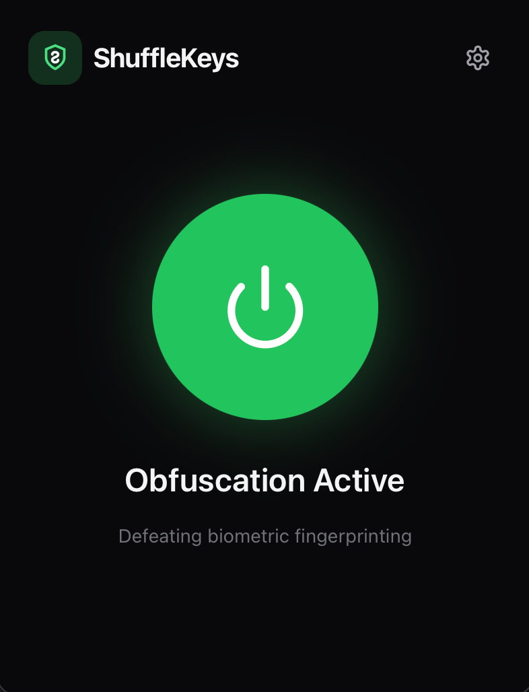
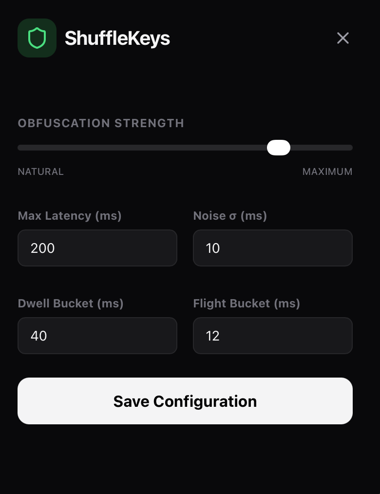
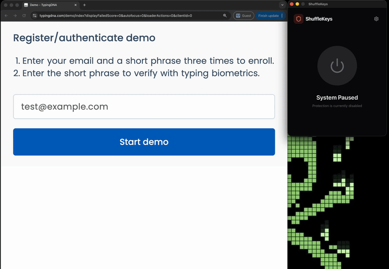

# ShuffleKeys

ShuffleKeys is a tool designed to protect your privacy by obfuscating your [keystroke dynamics](https://en.wikipedia.org/wiki/Keystroke_dynamics).

<div align="center">
  <table>
    <tr>
      <td align="center">
        <br />
        <em>Main Dashboard</em>
      </td>
      <td align="center">
        <br />
        <em>Configuration Settings</em>
      </td>
    </tr>
  </table>
</div>

## How it works

<p align="center">
  
</p>

Every person has a unique typing pattern—the specific timing between key presses (flight time) and the duration each key is held down (dwell time). Websites and trackers use high-resolution JavaScript timers to capture these patterns, creating a biometric "fingerprint" that can identify you across different sites, even if you use a VPN or incognito mode.

ShuffleKeys operates at the system level to neutralize this tracking. It intercepts your physical keystrokes, applies controlled timing noise and quantization (rounding the timing to discrete "buckets"), and then re-emits them as synthetic events with spoofed hardware timestamps. To a tracker, your unique typing rhythm is replaced by a consistent, randomized "persona" that cannot be linked back to you.

## Tech Stack

### Product
- **Core Engine**: [Rust](https://www.rust-lang.org/) — High-performance, low-latency keystroke manipulation using `nix`, `libc`, and OS-specific APIs (`evdev` on Linux, `CoreGraphics` on macOS).
- **Desktop Framework**: [Tauri v2](https://tauri.app/) — Lightweight desktop wrapper using native webviews for a minimal footprint.
- **Frontend UI**: [React](https://reactjs.org/) + [TypeScript](https://www.typescriptlang.org/) — Modern, type-safe interface for real-time monitoring and configuration.
- **Styling**: [Tailwind CSS](https://tailwindcss.com/) + [Lucide](https://lucide.dev/) — Sleek, utility-first design and iconography.

### Toolchain
- **Build System**: `Makefile` — Standardized entry points for CLI, UI, and maintenance tasks.
- **Backend Tooling**: `Cargo` (Package Manager), `Clippy` (Linter), `rustfmt` (Formatter).
- **Frontend Tooling**: `Vite` (Build Tool), `NPM` (Package Manager), `PostCSS` (CSS Transformation).

## Installation

### Prerequisites

- Rust toolchain (install via [rustup.rs](https://rustup.rs/))
- Node.js and npm

### Building from source

```bash
# Clone the repository
git clone https://github.com/your-repo/shufflekeys.git
cd shufflekeys

# Run the setup script to build and configure permissions
make setup
```

### macOS — Gatekeeper notice

ShuffleKeys is not signed with an Apple Developer certificate, so macOS will show a warning:

> "ShuffleKeys" cannot be opened because Apple could not verify it is free of malware.

To bypass this, remove the quarantine attribute after downloading:

```bash
xattr -cr /Applications/ShuffleKeys.app
```

Alternatively, right-click the app and select **Open** — macOS will give you the option to open it anyway.

## Usage

### Desktop App

The recommended way to use ShuffleKeys is through the desktop app:

```bash
make app
```

From the UI, you can toggle protection on and off and adjust the obfuscation strength.

### CLI

You can also run ShuffleKeys directly from the terminal:

```bash
make run            # Run with obfuscation ON (sudo)
make run-off        # Run in passthrough mode (sudo)
make run-status     # Show current config
```

### Developer Commands

```bash
make build          # Debug build
make test           # Run all tests
make lint           # Run clippy + format check
make fmt            # Auto-format code
make app-build      # Build desktop app for distribution
make ci             # Full CI pipeline
make help           # Show all available commands
```

### Permissions

#### macOS

The application requires **Accessibility** (and potentially **Input Monitoring**) permissions. The setup script will guide you to the correct menu in System Settings.

> **After reinstalling or updating**: macOS invalidates the existing accessibility grant when the binary changes. If the toggle is already on but ShuffleKeys reports missing permissions, toggle it **off and back on** (or remove the entry and re-add it) in System Settings -> Privacy & Security -> Accessibility.

#### Linux

The application requires access to `/dev/uinput`. The setup script will create the necessary udev rules and add your user to the `input` group. You must log out and back in for these changes to take effect.

## Configuration

Settings can be tuned in the Desktop UI or manually in `~/.config/shufflekeys/config.toml`:

- **Strength**: Balance between original timing and full obfuscation (0.7 is recommended).
- **Max Latency**: The maximum delay (in ms) allowed for a single keystroke.
- **Buckets**: The quantization level for timing intervals.
- **Noise**: The amount of Gaussian jitter added to prevent bucket analysis.
